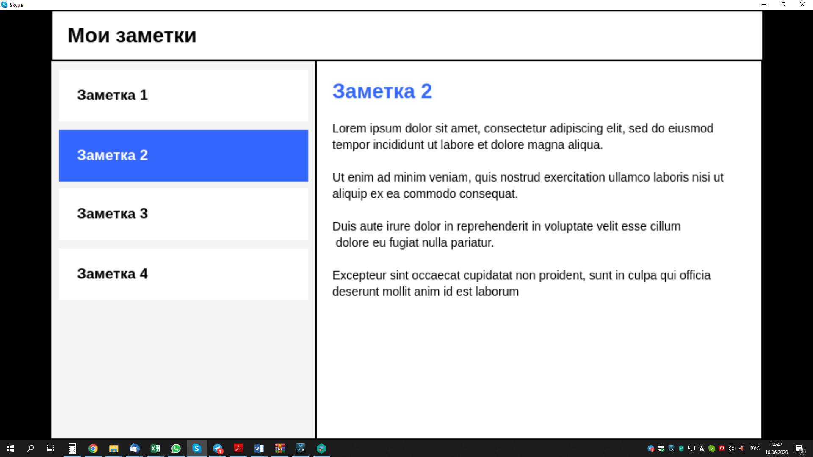

# TestCase

This project was generated with [Angular CLI](https://github.com/angular/angular-cli) version 9.1.15.

`Задача:`

используя фреймворк Angular 9 сверстать веб-приложение для просмотра текстовых заметок.

Интерфейс приложения должен состоять из трех компонентов:

-Верхняя шапка с названием;

-Боковое меню со списком заметок;

-Область для просмотра выбранной заметки;

Реализуете хранение предустановленных заметок в виде массива объектов, а не в HTML;

Реализуете возможность добавления заметок;

Реализуете возможность доступа к каждой заметке по прямой ссылке.

Список заметок должен быть предустановлен вами, каждая заметка имеет заголовок и текст. 

В боковом меню выводятся заголовки, при выборе одного из них - справа выводится текст выбранной заметки. 

Интерфейс должен растягиваться на всё окно браузера, при этом шапка имеет фиксированную высоту, а боковое меню - фиксированную ширину.

На проверку принимается папка с Angular-проектом, но без(!) папки node_modules внутри.

[docs.google.com](https://docs.google.com/document/d/19jW10pFBajMRhaDTOWFjDV72sWymFHAHDhjmkPqQ_LQ/edit)

